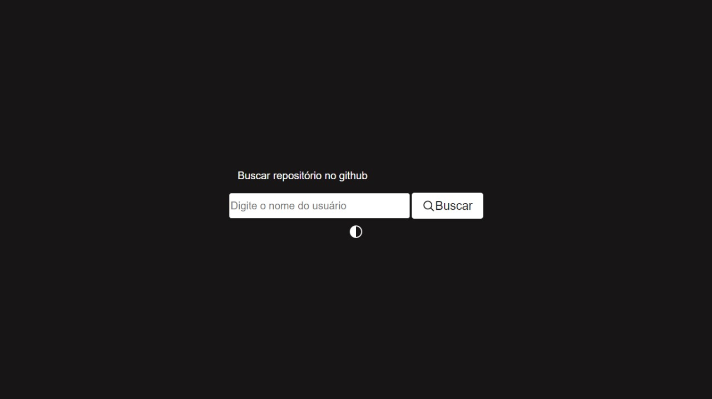
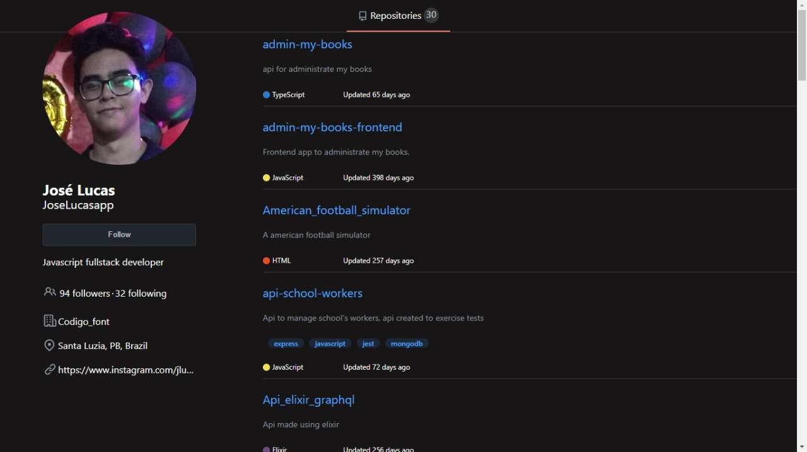

# WebApp
<table>
<tr>
<td>
  A webapp using GitHub API to display repositories.
</td>
</tr>
</table>

## Demo
Here is a working live demo :  https://jose-lucas-desafio-react.vercel.app/

## How to use?
On the first page you can search for an user, and on the second page you will see all his latest 30 public repositories.

## Site

### Landing Page
Currently it is working on vercel.

### Repositories page

### Themes
The app has two themes (light and dark).

### Tools
<ul>
  <li>React</li>
  <li>Typescript</li>
  <li>Axios</li>
  <li>Sweet Alert</li>
  <li>Github API</li>
</ul>
